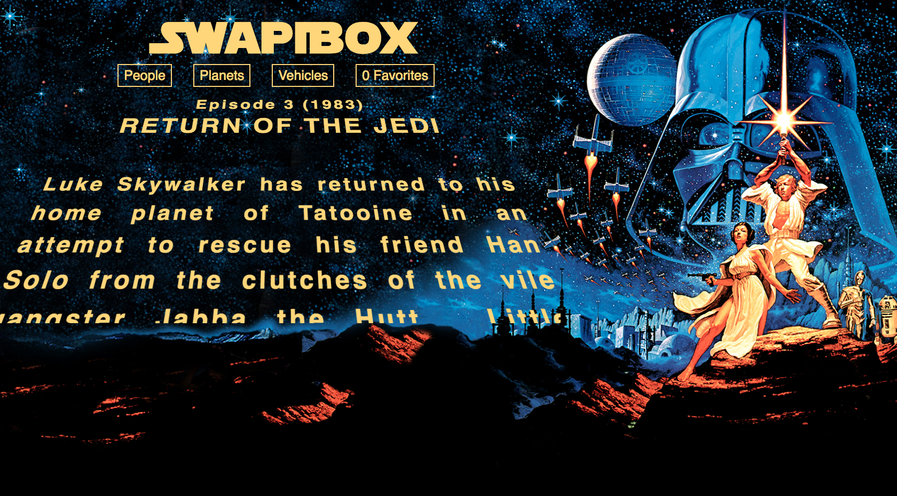

# SwapiBox

SwapiBox is a react app that allows users to view various facts about StarWars. Currently, SwapiBox shows opening movie crawls, poeple, planets, and vehicles. There are future plans to implement a favorites count and page along with the ability to display more than ten of each category. 

## Project Goals

This is a Mod3 Front-End project designed to challenge our skills at manipulating data and creating small, reusable React components using the 'create-react-app' boilerplate. I fetched the data from the StarWars api at https://swapi.co/api/. This was the first time implementing React Rounter along with Async Await. Jest and Enzyme were used to test the app along with PropTypes to validate props passed to each component. 

## Team

Charles Yach

## Set Up

Clone this repository

Run `npm install` from the root directory

Run `npm start` and visit localhost:3000 in your browser

## Screenshot

